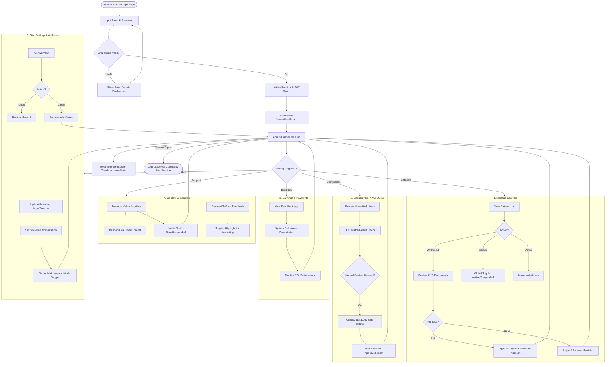

# Complete Admin Journey

Narito ang detalyadong flowchart ng proseso ni Admin, mula login hanggang sa pagtapos ng mga gawain.

### Pagsusuri base sa iyong Website:
1.  **Login Logic**: Sa `auth.py`, ang admin ay dadaan sa `verify_password` at ire-redirect sa `/admin/dashboard` kapag successful.
2.  **Caterer Management**: Sa `admin.py`, ang pag-approve ng caterer ay awtomatikong mag-seset ng kanilang status to `active` (ito ang `C5` sa flowchart).
3.  **Real-time Notifications**: Nag-uupdate ang badge kapag may bagong registration o booking via WebSocket.
4.  **Recycle Bin (Archives)**: Pwedeng i-restore o tuluyang burahin ang records gaya ng Archived Bookings at Users.
